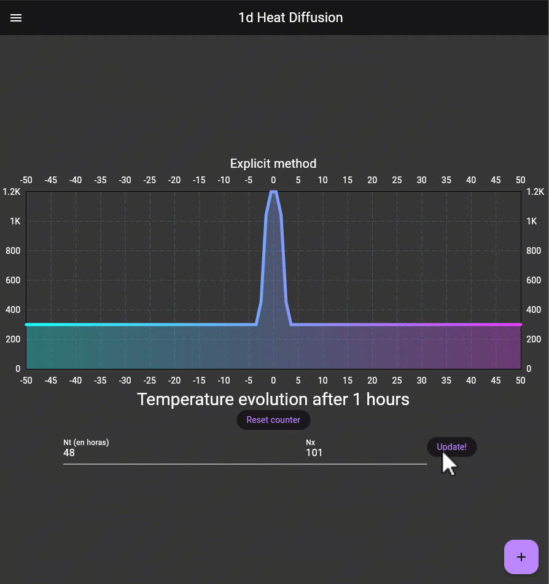
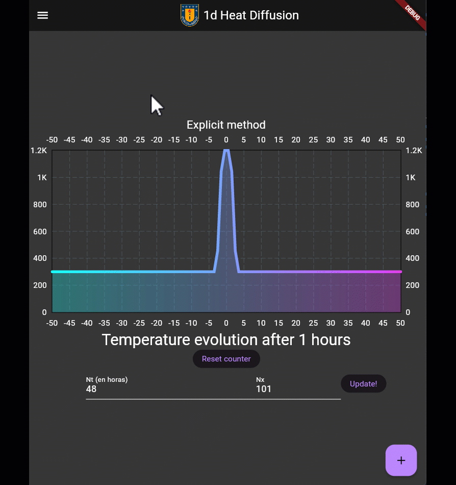

# 1d_heat_diffusion
## Web application:   https://alexvillarroel.github.io/1d_heat_diffusion/#/
Aplication that explain the head_difusion in 1d using Dart and flutter with implicit and explicit method.
## Difussion code
```dart
import 'package:scidart/numdart.dart';
import 'package:fl_chart/fl_chart.dart';
import 'package:equations/equations.dart';

List<FlSpot> explicit_diffusion(int hora, int nt) {
  num L = 100; // longitude of x in meters
  num W = 5.0; // longitude of dam in meters
  num R = 300.0; // temperature out of dam(rock)
  num D = 1200.0; // temperature within dam
  num K = 1e-6; // kappa parameter(thermal diffusivity)
  num day = 3600 * 24; // seconds per day
  num dt = nt / 24 * day;
  //Numerical parameters
  num nx = 101; // Number of gridpoints in x-direction
  num dx = L / (nx - 1); // % Spacing of grid
  num alpha = K * dt / pow(dx, 2); // Courant–Friedrichs–Lewy condition
  Array x =
      linspace(-L / 2, L / 2, num: L ~/ dx); // Grid var range = 1..20.step(2);
  List<double> T =
      arrayMultiplyToScalar(ones(x.length), R); // array of R values
  for (int i = 0; i < x.length; i++) {
    if (x[i].abs() <= W / 2) {
      T[i] = D.toDouble();
    }
  } // this for its like the function find in matlab, iterate the vector and
  // see a condition, if the condition is true, the value change
  List<FlSpot> listaSpots = [];
  double time = 0.0;
  num cfl = 2 * K * dt / pow(dx, 2);
  if (0 < cfl && cfl < 1) {
    // see the CFL coondition
    for (int n = 1; n <= nt - 1; n++) {
      // iterating the time with timestep of 1 hour
      // Compute new temperature
      Array Tnew = zeros(nx as int); // zeros matrix
      for (int i = 1; i <= nx - 3; i++) {
        Tnew[i] = T![i] + alpha * (T[i + 1] - 2 * T[i] + T[i - 1]);
      }
      //Set boundary conditions
      Tnew[0] = T[0];
      Tnew[nx - 2] = T[nx - 2];
      // Update temperature and time
      T = Tnew;
      if (hora == n) {
        // setting the values (x,T) in listaSpots
        for (int i = 0; i < x.length; i++) {
          double x1 = x[i];
          double y = T[i];
          listaSpots.add(FlSpot(x1, y));
        }
      }
      time = time + dt;
    }
  } else {
    listaSpots = [];
  }
  return listaSpots.toList();
}

List<FlSpot> implicit_diffusion(int hora, int nt) {
  num L = 100; // longitude of x in meters
  num W = 5.0; // longitude of dam in meters
  double R = 300.0; // temperature out of dam(rock)
  double D = 1200.0; // temperature within dam
  num K = 1e-6; // kappa parameter(thermal diffusivity)
  num day = 3600 * 24; // seconds per day
  num dt = nt / 24 * day; // numbber of gridpoints in t-directon
  //Numerical parameters
  int nx = 101; // Number of gridpoints in x-direction
  num dx = L / (nx - 1); // % Spacing of grid
  double s = K * dt / pow(dx, 2); // Courant–Friedrichs–Lewy condition
  Array x =
      linspace(-L / 2, L / 2, num: L ~/ dx); // Grid var range = 1..20.step(2);
  Array T = arrayMultiplyToScalar(ones(x.length), R); // array of R values

  List<List<double>> matrix =
      List.generate(nt, (i) => List.generate(nx, (j) => R));
  List<List<double>> A = List.generate(nx, (i) => List.generate(nx, (j) => 0));

  //
  for (int j = 0; j < nt; j++) {
    matrix.add(T);
  }
  // we define matrix A with zeros
  // Array2d A = Array2d.fixed(nx, nx);
  // //
  for (int i = 0; i < nt; i++) {
    for (int j = 0; j < nx - 1; j++) {
      if (x[j].abs() <= W / 2) {
        matrix[i][j] = D; // matrix of temperature of rock and dam for all times
      } //
    }
  }
  // see a condition, if the condition is true, the value change
  // setting the boundary conditions
  // here it set the matrix condition of nx,nx size
  A[0][0] = 1;
  A[nx - 1][nx - 1] = 1;
  for (int i = 1; i < nx - 1; i++) {
    A[i][i - 1] = -s;
    A[i][i] = (1 + 2 * s);
    A[i][i + 1] = -s;
  }
  // here solve the system equation and set the solution inside the matrix
  for (int i = 1; i < nt; i++) {
    matrix[i] = LUSolver(
            matrix: RealMatrix.fromData(rows: nx, columns: nx, data: A),
            knownValues: matrix[i - 1])
        .solve();
  }
  // add interest points() to an List<FlSpot>
  List<FlSpot> listaSpots = [];
  for (int i = 0; i < x.length; i++) {
    listaSpots.add(FlSpot(x[i], matrix[hora][i]));
  }
  return listaSpots;
}


```
## media



